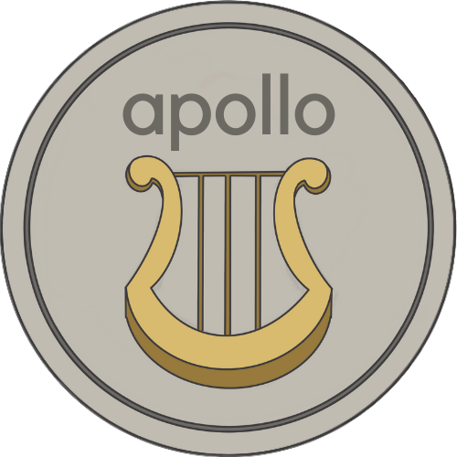

<h1>apollo</h1>

Apollo is a client-side React app that lets users view music album reviews and post their own.
<br/>
Developed by:
<ul>
  <li>Kaylyn Phan</li>
  <li>Hyerin Lee</li>
  <li>Madurya Suresh</li>
  <li>Pavana Atawale</li>
</ul>



To run the app:

```[bash]
# clone this repository
$ git clone https://github.com/kaylynphan/apollo.git
# cd into the repository's root directory and install required packages
$ cd apollo
$ npm install react-router-dom
$ npm install react-icons
$ npm install @mui/material @emotion/react @emotion/styled @mui/icons-material
$ npm install firebase
$ npm start # View app on localhost:3000
```

<h4>Features:</h4>
<ul>
  
<li>Search for your favorite artists on the home page.</li>
<li>Click on an album cover to listen to the album on Spotify.</li>
<li>Log in through your Google Account using the Log in button and start posting reviews.</li>
<li>Liking, disliking, and posting reviews are only enabled for logged in users.</li>
<li>Non-logged in users can still browse through the website.</li>
<li>Like or dislike other reviews.</li>
<li>Apollo works best on Google Chrome.</li>
  
</ul>
<h4><a href="https://docs.google.com/presentation/d/1E9e-s0ZPjXZqYnwp0iGzFRysuPv_kRMmLahkLUeIxfk/edit?usp=sharing" target="_blank">Here</a> is the link to our presentation. </h4>
